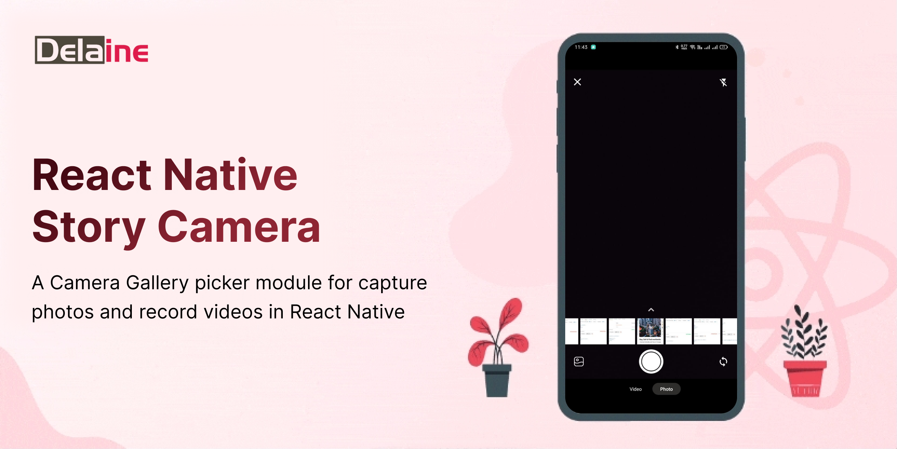
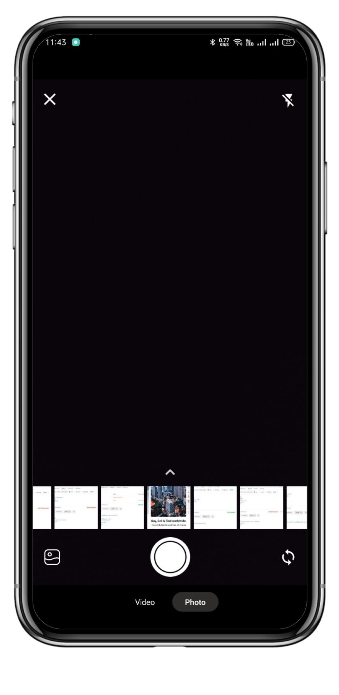

# react-native-story-camera

<!-- [](https://www.npmjs.com/package/react-native-story-view) [](https://www.npmtrends.com/react-native-story-view) [](https://packagephobia.com/result?p=react-native-story-view) [](https://www.android.com) [](https://developer.apple.com/ios) [](https://opensource.org/licenses/MIT) -->

---

React Native Story Camera is a Fully Customizable UI Library that provide camera picker module for capture photos and record videos in React Native, inspired by WhatsApp's media sharing experience.


## 🎬  Overview

React Native Story Camera allows users to capture videos and photos, as well as select multiple images and videos from their device gallery. Built with the latest version of React Native, this module provides a seamless, bug-free experience, optimized for performance and functionality.
It is simple to use and fully customizable. It works on both android and iOS platforms.


## 🎬  Features

* **Capture videos and photos**: with a customizable camera interface
* **Select multiple images and videos**: from device gallery
* **Pagination**: for media list available
* **Video Recording**: smooth video recording 
* **Fully customizable**: with available props
* **Cross-platform compatibility**: compatible with both Android and iOS platforms
* **Formatted Data**: return formatted and optimized data from camera and gallery for all media type
* **Optimized for performance**: optimized for performance and functionality


## 🎬 Preview

---           
| ------------------------------------
| 

---

## 🎬 Quick Access

[🎬 Installation](#installation) | [Permissions](#permissions) | [Usage](#usage) | [Props](#props) | [Example](#example) | [License](#license)

## Installation

##### 1. Install React Native Story Camera

```bash
  npm install @delainetech/react-native-story-camera
```
#### --- or ---
```bash
  yarn add @delainetech/react-native-media-picker
```

##### 2. Install peer dependencies

To use React Native Story Camera, you need to install the following dependencies:

[react-native-vision-camera](https://github.com/mrousavy/react-native-vision-camera "react-native-vision-camera") is a camera library for React Native apps. 

[@react-native-camera-roll/camera-roll](https://www.npmjs.com/package/@react-native-camera-roll/camera-roll "@react-native-camera-roll/camera-roll") is used to access media files from device library

[react-native-image-crop-picker](https://github.com/ivpusic/react-native-image-crop-picker) is a media picker library for React Native apps. 

[react-native-permissions](https://www.npmjs.com/package/react-native-permissions "react-native-permissions") is added to access camera and storage permission in Android & IOS devices.

[react-native-reanimated](https://www.npmjs.com/package/react-native-reanimated) is a animation library for React Native apps. 

[react-native-gesture-handler](https://www.npmjs.com/package/react-native-gesture-handler) is a gesture effects library for React Native apps. 


```bash
$ npm install react-native-vision-camera react-native-permissions react-native-reanimated react-native-gesture-handler @react-native-camera-roll/camera-roll react-native-image-crop-picker

# --- or ---

$ yarn add react-native-vision-camera react-native-permissions react-native-reanimated react-native-gesture-handler @react-native-camera-roll/camera-roll react-native-image-crop-picker
```

> Note: If you already have these libraries installed of the latest versions, you are done here! . If not then please Please follow the installation instructions for each dependency on their respective GitHub pages.


##### 3. Install cocoapods in the ios project

```bash
cd ios && pod install
```

> Note: Make sure to add Reanimated's babel plugin to your `babel.config.js`

```
module.exports = {
      ...   // do not add it here
      plugins: [
          ...
          'react-native-reanimated/plugin',
      ],
  };
```


---


## Permissions

To use React Native Story Camera, you need to add the following permissions to your project:

##### 1. iOS   

Add the following permissions to your project `Info.plist` file:
```xml
<key>NSCameraUsageDescription</key>
<string>Allow access to capture photo</string>

<key>NSMicrophoneUsageDescription</key>
<string>Allow access to record audio</string>

<key>NSPhotoLibraryUsageDescription</key>
<string>Allow access to select photo</string>


```
##### 2. Android

Add the following permissions to your `AndroidManifest.xml` file:
```xml
<uses-permission android:name="android.permission.READ_EXTERNAL_STORAGE"/>
<uses-permission android:name="android.permission.WRITE_EXTERNAL_STORAGE"/>
<uses-permission android:name="android.permission.CAMERA"/>
<uses-permission android:name="android.permission.RECORD_AUDIO"/>
<uses-permission android:name="android.permission.READ_MEDIA_IMAGES"/>
<uses-permission android:name="android.permission.READ_MEDIA_VIDEOS"/>
```
> Note: After added these above permission . You are done here . No Need to do extra permission work in your main component file . 

## Usage
-----------------------------------------------------------

```javascript

import React from 'react'

import { StyleSheet, Text, View } from 'react-native'

import { GestureHandlerRootView } from 'react-native-gesture-handler';

import CameraPicker from 'react-native-story-camera';

export default const App =()=> 
{
  return (
    <GestureHandlerRootView style={{ flex: 1 , backgroundColor:"white" }}>

       <CameraPicker
        onSelect={(data)=>console.log("Data from  camera picker : ",data)}
        onBackPress={()=>console.log("add your code  here for back press")}/>

    </GestureHandlerRootView>
  );
}

```


## Props
| Prop                | Default                         | Type      | Description                                                                                                                                                                                                                       |
| :------------------ | :------------------------------ | :-------- | :-------------------------------------------------------------------------------------------------------------------------------------------------------------------------------------------------------------------------------- |
| containerStyle                | {}                         | ViewStyle    | CameraPicker container view style                                                                                                                                                                               |
| items               | [ReactionItems](#reactionitems) | array     | Array of reaction emojis                                                                                                                                                                                                          |
| disabled            | false                           | boolean   | If true, disable all interactions for this component                                                                                                                                                                              |
| showPopupType       | default                         | string    | Pressable showPopupType like default and onPress<br />- If showPopupType is default, then reaction popup will be shown on onLongPress only<br /> - If showPopupType is onPress, then reaction popup will be shown on onPress only |
| onPress             | -                               | function  | Callback function that triggers when the wrapped element is pressed                                                                                                                                                               |
| onLongPress         | -                               | function  | Callback function that triggers when the wrapped element is long pressed                                                                                                                                                          |
| onTap               | -                               | function  | Callback function that returns selected emoji                                                                                                                                                                                     |
| cardStyle           | {}                              | ViewStyle | Card modal style                                                                                                                                                                                                                  |
| emojiStyle          | {}                              | TextStyle | Emoji style                                                                                                                                                                                                                       |
| onShowDismissCard   | -                               | function  | Callback function that returns reaction card popup status (true / false)                                                                                                                                                          |
| isShowCardInCenter  | false                           | boolean   | If true, Show card in center                                                                                                                                                                                                      |
| iconSize            | 25                              | number    | Size of emoji. It should be in between 15 to 30.                                                                                                                                                                                  |
| titleStyle          | {}                              | TextStyle | Title style for emoji                                                                                                                                                                                                             |
| titleBoxStyle       | {}                              | ViewStyle | Title box style                                                                                                                                                                                                                   |
| emojiContainerStyle | {}                              | ViewStyle | Emoji container style                                                                                                                                                                                                             |
| cardDuration        | 150                             | number    | Card animation duration                                                                                                                                                                                                           |
| opacityRange        | [0, 0, 1]                       | array     | Opacity range for card container (`note`: opacity range must be in ascending order)                                                                                                                                               |
| emojiDuration       | 200                             | number    | Emoji animation duration                                                                                                                                                                                                          |
| scaleDuration       | 100                             | number    | Scale animation duration                                                                                                                                                                                                          |

---

---

## Repository

Checkout our GitHub repository
[@delainetech/react-native-story-camera](https://github.com/delainetech/react-native-story-camera "react-native-story-camera") <br/>


## Contributors

[Pardeep Sharma](https://github.com/Pardeep03315 "Pardeep Sharma") <br/>
[Surbhi](https://github.com/Surbhi1892 "Surbhi") <br/>
